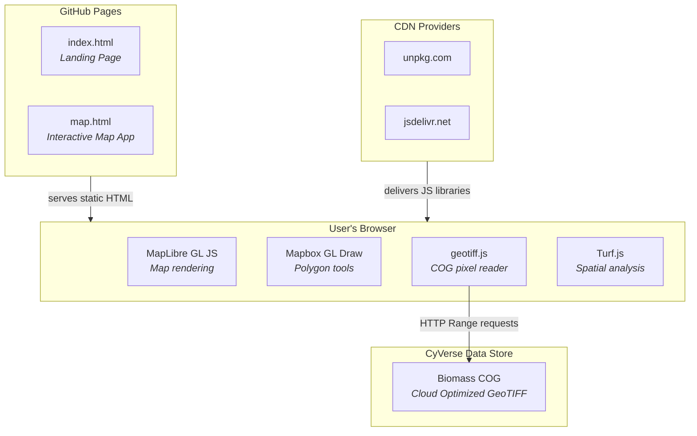
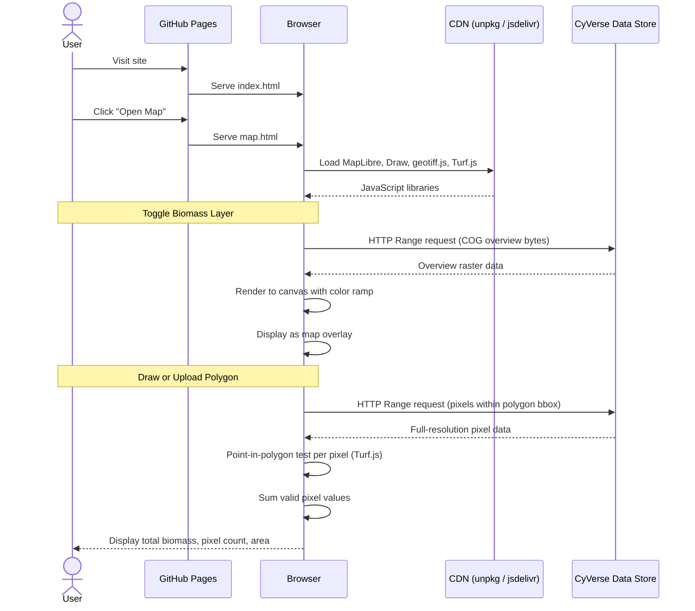
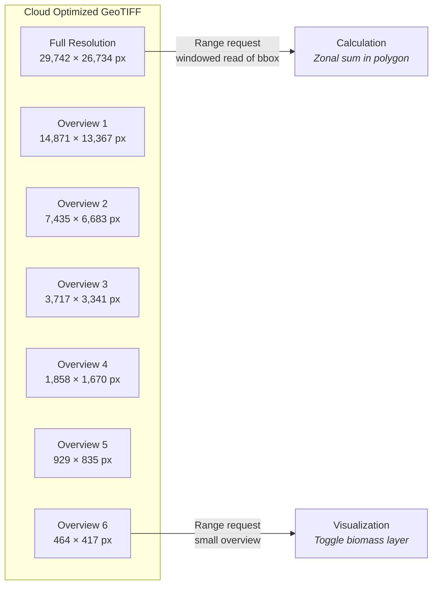

# Biomass Explorer

A lightweight, client-side web application for visualizing biomass raster data on an interactive map and calculating zonal statistics within user-defined areas of interest. The entire application runs in the browser — no backend server required.

**[Live Demo](https://jeffgillan.github.io/living_carbon_demo/)**

---

## Application Architecture



---

## Repository Structure

```
living_carbon_demo/
├── index.html          # Landing page with app description
├── map.html            # Interactive map application (single-file)
├── biomass-app-spec.md # Application specification
├── README.md
└── LICENSE
```

The map application is a **single HTML file** (`map.html`) containing all markup, styles, and JavaScript. There is no build step, no bundler, and no `node_modules` — all third-party libraries are loaded at runtime from CDNs.

---

## Technology Stack

All libraries are loaded via `<script>` and `<link>` tags directly from Content Delivery Networks (CDNs). This means:

- **No installation required** — no `npm install`, no package manager
- **No build step** — no webpack, vite, or bundler
- **Instant setup** — clone the repo and serve the HTML files

| Library | Version | CDN | Purpose |
|---------|---------|-----|---------|
| [MapLibre GL JS](https://maplibre.org/) | 5.1.0 | `unpkg.com/maplibre-gl` | Map rendering, ESRI World Imagery basemap, layer management |
| [Mapbox GL Draw](https://github.com/mapbox/mapbox-gl-draw) | 1.5.0 | `unpkg.com/@mapbox/mapbox-gl-draw` | Polygon drawing and editing tools on the map |
| [geotiff.js](https://geotiffjs.github.io/) | 2.1.3 | `cdn.jsdelivr.net/npm/geotiff` | Reading Cloud Optimized GeoTIFF pixel data via HTTP range requests |
| [Turf.js](https://turfjs.org/) | 7.x | `unpkg.com/@turf/turf` | Spatial operations: bounding box, point-in-polygon, area calculation |

---

## How It Works



### Key Steps

1. **Map loads** with ESRI World Imagery basemap centered on the study area
2. **Biomass layer toggle** reads a low-resolution overview from the COG and renders it as a colored overlay
3. **User defines an area** by drawing a polygon on the map or uploading a GeoJSON file
4. **Zonal calculation** reads only the full-resolution pixels within the polygon's bounding box, tests each pixel center for containment, and sums the valid values
5. **Results display** shows total biomass, number of pixels summed, and polygon area in hectares

---

## Biomass Data Layer

The biomass raster is stored as a **Cloud Optimized GeoTIFF (COG)** on the [CyVerse](https://cyverse.org/) Data Store with public anonymous access.

### What is a COG?

A Cloud Optimized GeoTIFF is a regular GeoTIFF organized so that clients can request just the portions they need via **HTTP Range requests** instead of downloading the entire file. Key features:

- **Internal tiling** — pixels are stored in tiles rather than strips, enabling spatial queries
- **Overview pyramids** — pre-computed lower-resolution copies for fast visualization at different zoom levels
- **Byte-range accessible** — standard HTTP servers can serve partial file reads without special software

### How the App Streams COG Data



- **For visualization**: The app reads the smallest overview pyramid (e.g., 464 × 417 px) — only a few hundred KB of data — and renders it to an HTML canvas with a green color ramp
- **For calculation**: The app reads only the full-resolution pixels within the polygon's bounding box using `image.readRasters({ window })` — avoiding loading the entire raster into memory

The COG is accessed using `geotiff.js`, which issues standard HTTP `GET` requests with `Range` headers to the CyVerse `dav-anon` endpoint. No special server-side software is needed.

**Current COG URL:**
```
https://data.cyverse.org/dav-anon/iplant/home/jgillan/living_carbon_demo/se_arizona_dem.tif
```

The COG must be in **EPSG:4326** (WGS84 geographic coordinates) to align with GeoJSON polygons and the web map.

---

## Local Development

Since the app fetches remote data via HTTP, it must be served from a local web server (not opened directly as a `file://` path due to browser CORS restrictions).

```bash
# Clone the repository
git clone https://github.com/jeffgillan/living_carbon_demo.git
cd living_carbon_demo

# Start a local server
python3 -m http.server 8000

# Open in browser
# http://localhost:8000
```

Press `Ctrl+C` to stop the server.

---

## Deployment

The app is hosted as a **static website on GitHub Pages**:

- **Source**: `main` branch, root directory (`/`)
- **Build step**: None — GitHub Pages serves the HTML files directly
- **URL**: `https://jeffgillan.github.io/living_carbon_demo/`

To deploy changes, simply push to the `main` branch:

```bash
git add .
git commit -m "Update app"
git push origin main
```

GitHub Pages will automatically rebuild and serve the updated files.

---

## License

[MIT](LICENSE)
